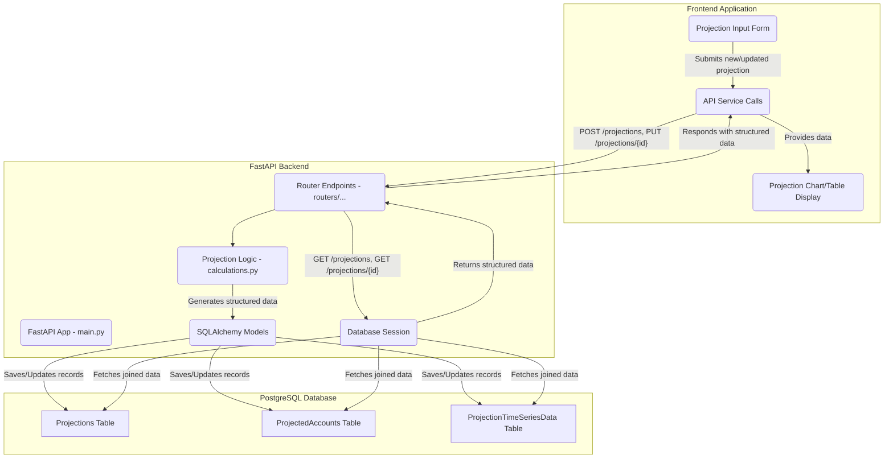

# Plan for Rearchitecting Storage and Projections

The goal is to move the projection data, currently stored in JSON blobs (`data_json` and `accounts_json`) within your `models.Projection` model, into a normalized SQL database structure. This will enhance querying, data integrity, and efficiency.

#### 1. Database Schema Design (New Models)

We will introduce new database models to represent the structure of a projection's accounts and time-series data.

**New Model: `models.ProjectedAccount`**

This model will store the individual accounts that make up a projection.

```python
# api/models.py
import sqlalchemy as sa
from sqlalchemy.dialects.postgresql import JSONB
from sqlalchemy.orm import relationship
from .database import Base

class ProjectedAccount(Base):
    __tablename__ = "projected_accounts"

    id = sa.Column(sa.Integer, primary_key=True, index=True)
    projection_id = sa.Column(sa.Integer, sa.ForeignKey("projections.id"), nullable=False)
    
    name = sa.Column(sa.String, index=True)
    account_type = sa.Column(sa.String) # e.g., "asset", "liability", "income", "expense"
    initial_value = sa.Column(sa.Float)
    contribution = sa.Column(sa.Float)
    growth_rate = sa.Column(sa.Float)
    
    # Relationship back to the Projection
    projection = relationship("Projection", back_populates="accounts_data")

    # Future fields: could include specific details for different account types
    # e.g., interest_rate, loan_term_months for liabilities, etc.
```

**New Model: `models.ProjectionTimeSeriesData`**

This model will store the time-series values for each account within a projection for each year.

```python
# api/models.py
import sqlalchemy as sa
from sqlalchemy.orm import relationship
from .database import Base

class ProjectionTimeSeriesData(Base):
    __tablename__ = "projection_time_series_data"

    id = sa.Column(sa.Integer, primary_key=True, index=True)
    projection_id = sa.Column(sa.Integer, sa.ForeignKey("projections.id"), nullable=False)
    account_id = sa.Column(sa.Integer, sa.ForeignKey("projected_accounts.id"), nullable=True) # Optional: link to a specific account
    
    year = sa.Column(sa.Integer, index=True)
    # The 'type' of value being stored (e.g., "account_balance", "total_cashflow", "total_assets", "total_liabilities")
    value_type = sa.Column(sa.String, index=True)
    value = sa.Column(sa.Float)

    # Relationships
    projection = relationship("Projection", back_populates="time_series_data")
    account = relationship("ProjectedAccount") # If linking to a specific account
```

**Update `models.Projection`**

We will remove the JSON fields and add relationships to the new models.

```python
# api/models.py (modifications)
import sqlalchemy as sa
from sqlalchemy.orm import relationship
from .database import Base

class Projection(Base):
    __tablename__ = "projections"

    id = sa.Column(sa.Integer, primary_key=True, index=True)
    owner_id = sa.Column(sa.Integer, sa.ForeignKey("users.id"), nullable=False)
    name = sa.Column(sa.String, index=True)
    years = sa.Column(sa.Integer) # Number of years for the projection
    final_value = sa.Column(sa.Float)
    total_contributed = sa.Column(sa.Float)
    total_growth = sa.Column(sa.Float)
    timestamp = sa.Column(sa.DateTime, default=sa.func.now())

    # REMOVE THESE:
    # data_json = sa.Column(JSONB)
    # accounts_json = sa.Column(JSONB)

    # NEW RELATIONSHIPS:
    owner = relationship("User", back_populates="projections")
    accounts_data = relationship("ProjectedAccount", cascade="all, delete-orphan", back_populates="projection")
    time_series_data = relationship("ProjectionTimeSeriesData", cascade="all, delete-orphan", back_populates="projection")
```

#### 2. Alembic Migrations

We'll need a new Alembic migration to apply these schema changes:

*   **Generate migration**: `alembic revision --autogenerate -m "Refactor projection data into normalized tables"`
*   **Review and adjust**: Manually review the generated migration script (e.g., `api/alembic/versions/{timestamp}_refactor_projection_dat-into_normalized_tables.py`). Ensure it correctly:
    *   Creates `projected_accounts` and `projection_time_series_data` tables.
    *   Adds `projection_id` to new tables with foreign key constraints.
    *   Removes `data_json` and `accounts_json` columns from `projections` table.
    *   (Optional but recommended for existing data) Includes logic to migrate existing JSON data into the new tables. This would be a complex step, likely involving reading existing `Projection` records, parsing `data_json` and `accounts_json`, and inserting them into the new tables.

#### 3. Update Schemas (`api/schemas.py`)

The Pydantic schemas will need to be updated to reflect the new data models.

*   **New Schema: `schemas.ProjectedAccountBase` / `schemas.ProjectedAccountCreate` / `schemas.ProjectedAccountOut`**
*   **New Schema: `schemas.ProjectionTimeSeriesDataBase` / `schemas.ProjectionTimeSeriesDataOut`**
*   **Update `schemas.ProjectionRequest`**: Instead of `accounts: List[AccountSchema]`, it will likely need to be a list of `ProjectedAccountCreate` objects or similar.
*   **Update `schemas.ProjectionResponse` / `schemas.ProjectionDetailOut`**: These will no longer return JSON blobs but will include nested `ProjectedAccountOut` and `ProjectionTimeSeriesDataOut` lists.

#### 4. Update CRUD Operations and Calculation Logic (`api/calculations.py`, `api/main.py`)

This is the most significant code change:

*   **`api/calculations.py`**:
    *   The `calculate_projection` function will need to be refactored to populate the new `ProjectedAccount` and `ProjectionTimeSeriesData` models directly.
    *   It will now return these model instances (or their data) rather than raw JSON structures.
*   **`api/main.py`**:
    *   **`create_projection` endpoint**:
        *   Will receive a list of `ProjectedAccountCreate` (or similar) in the request body.
        *   Will pass this structured data to the updated `calculations.calculate_projection`.
        *   Will then save the new `Projection`, `ProjectedAccount`, and `ProjectionTimeSeriesData` records to the database.
    *   **`get_projection_details` and `list_projections` endpoints**:
        *   Will need to eager-load (`.options(joinedload(Projection.accounts_data), joinedload(Projection.time_series_data))`) the related `ProjectedAccount` and `ProjectionTimeSeriesData` when querying `Projection` objects, to avoid N+1 query problems.
        *   The response models will need to serialize this nested structure correctly.
    *   **`update_projection` endpoint**:
        *   Will need logic to update or create/delete associated `ProjectedAccount` and `ProjectionTimeSeriesData` records based on changes in the `ProjectionRequest`.

#### 5. Frontend Implications (`ui/src/services/projection.service.js`, `ui/src/components/ProjectionChart.jsx`, etc.)

The frontend will need significant updates:

*   **API Service**: `projection.service.js` will need to adjust its request and response parsing to handle the new structured data instead of JSON blobs.
*   **Components**: `ProjectionDetail.jsx`, `ProjectionChart.jsx`, and any other components that consume or display projection data will need to be refactored to work with the normalized data structure. This will likely simplify frontend logic by moving data processing concerns to the backend.

#### Architecture Diagram


